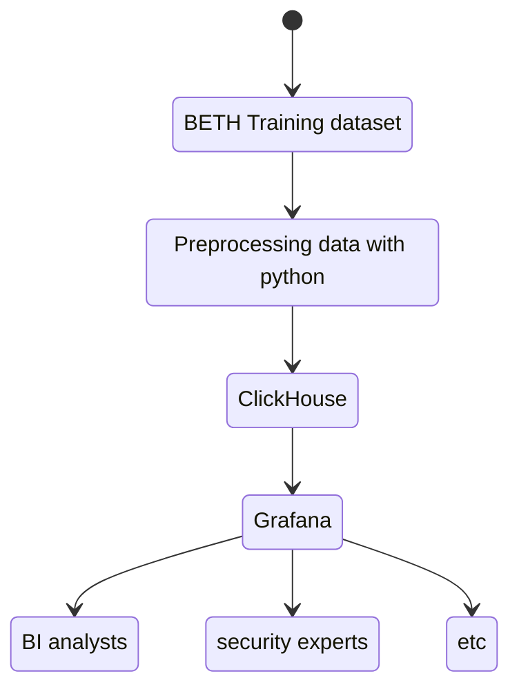

# ВІ система и аналитика + визуализация - clickhouse

## 1. Topic: ВІ система и аналитика + визуализация - clickhouse

---

- Objective:
  This paper aims to explore the integration of ClickHouse with Grafana for effective visualization and analysis, focusing on its application in Business Intelligence (BI) systems.
  ***

## 2. Content

### 2.1 Introduction

**Overview**:
In today's world of big data, there is an increasing demand for collecting, managing, analyzing, and visualizing vast amounts of data, whether for security purposes or to inform business strategies. Business Intelligence (BI) systems play a pivotal role in streamlining these tasks, providing enhanced security, efficiency, and actionable insights.

This paper focuses on the integration of ClickHouse, a high-performance data warehouse for online analytical processing (OLAP) queries, with Grafana, an open-source platform used for monitoring, visualization, and alerting of metrics.

**Research Question**: What roles do Grafana and ClickHouse play in the Business Intelligence workflow, and how can their integration enhance the data analysis and visualization process?

### 2.2. Relevance

#### 2.2.1. Architecture and Technologies

**Overview of BI System Architecture:**

Business Intelligence Architecture refers to the framework of technologies, processes, and tools used to collect, store, manage, and analyze data to support business decision-making. The business intelligence architecture layers is designed to turn raw data into actionable insights by utilizing a combination of data management, data analytics, and data visualization [2].

**Key Components:**

1. **Data Source Layer (ClickHouse)**:

   - **ClickHouse** is an open-source column-oriented DBMS for online analytical processing that allows users to generate analytical reports using SQL queries in real-time.
   - ClickHouse is optimized for fast querying and aggregation, making it an ideal choice for BI tasks that require real-time insights.

2. **Data Processing Layer**:

   - This layer involves cleaning, transforming, and processing data before visualization. It can include ETL (Extract, Transform, Load) processes or direct querying from ClickHouse.
   - ClickHouse’s SQL capabilities can be leveraged to perform data transformation, aggregation, filtering, and summarization within this layer.

3. **Visualization Layer (Grafana)**:

   - **Grafana** connects directly to ClickHouse and is responsible for displaying data in user-friendly visualizations, dashboards, and reports.
   - Grafana supports a wide range of visual elements like time series charts, tables, and real-time dashboards, making it ideal for tracking key performance indicators (KPIs) and monitoring business trends.

4. **Alerting and Monitoring Layer**:
   - Grafana also facilitates alerting and monitoring, allowing users to set thresholds and trigger notifications if metrics exceed predefined limits.
   - This functionality ensures that BI stakeholders can take immediate, data-driven actions when necessary.

**Data Flow:**

1. **Data Ingestion**: [BETH testing dataset](https://www.kaggle.com/datasets/katehighnam/beth-dataset/data?select=labelled_testing_data.csv) is used and stored in ClickHouse.
2. **Data Querying and Processing**: Custom Python scripts are used to preprocess the data and insert the data into ClickHouse. ClickHouse processes the data using SQL queries, applying filters, transformations, and aggregations based on BI requirements.
3. **Visualization**: Grafana retrieves data from ClickHouse in real-time and presents it through customizable dashboards for users to explore trends, monitor KPIs, and analyze business performance.
4. **Alerting and Monitoring**: Alerts are triggered based on specified conditions, and notifications are sent to relevant stakeholders to address critical issues promptly.

**Architecture Diagram:**



### 2.3. System Design

#### 2.3.1. Implementation and Testing

#### 2.3.1.1 ClickHouse Setup

ClickHouse provides a well-documented installation process, which you can find [here](https://clickhouse.com/docs/en/install). In this paper, we demonstrate installing ClickHouse on both Linux and macOS. For this section, we will focus specifically on the macOS installation.

To set up ClickHouse on macOS, follow these steps:

1. **Download ClickHouse:**

   - The simplest way to download ClickHouse locally is to run the following command:

   ```bash
   curl https://clickhouse.com/ | sh

   ```

2. **Start the ClickHouse Server:**

- After the installation, start the ClickHouse server by running:

```bash
   ./clickhouse server
```


> Note: For enhanced security, it is recommended to change the default password and add a user after the initial setup.

## references

1. What is business intelligence? [electronic resource]. URL: https://www.ibm.com/topics/business-intelligence (date of reference: 23.12.2024).
2. Understanding Business Intelligence Architecture: A Comprehensive Guide [electronic resource]. URL: https://www.sprinkledata.com/blogs/understanding-business-intelligence-architecture-a-comprehensive-guide (date of reference: 23.12.2024).
3. Grafana: инструмент для удобной визуализации метрик мониторинга [electronic resource]. URL: https://cloud.vk.com/blog/grafana-instrument-udobnoy-vizualizatsii-metrik-monitoringa/ (date of reference: 23.12.2024).
